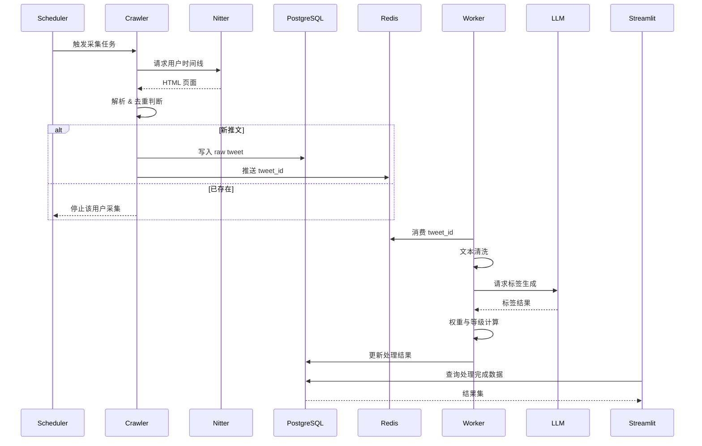

# 实现X（twitter）推文信息的收集

## 项目说明

构建一个**稳定、可扩展、低封禁风险**的 X（Twitter）推文信息收集与处理系统，实现：

- 面向**指定用户列表**的持续推文采集
- 推文内容的**清洗、结构化、标签化、权重评分**
- 面向第三方用户的**筛选展示与推送能力**

系统遵循 **“采集 → 解耦 → 处理 → 排序 → 展示”** 的流水线架构，最大化降低各模块耦合度。

## 技术设计

使用Docker+python+PostgreSQL+redis+streamlit+Nitter

* PostgreSQL+redis 数据存储及缓存
* Docker容器化运行环境
* streamlit 用于界面展示
* Nitter推文收集中间代理
  * https://xcancel.com/

### 1. 数据采集层（Crawler）

- **访问入口**：Nitter（xcancel.com 或自建实例）
- **职责**：
  - 获取指定用户的时间线首页（HTML）
  - 解析推文基础字段
  - 去重判断，避免重复采集

> 设计原则：
>
> - 永不直连 x.com
> - 单次采集只关注「最新增量」

---

### 2. 数据存储与缓冲层

#### PostgreSQL（主存储）

存储**结构化、可追溯的最终数据**：

- 原始推文
- 清洗后的正文
- 标签结果
- 权重/等级

#### Redis（中间态与队列）

- **采集队列**：新推文 ID / URL
- **处理队列**：等待 LLM 处理的推文
- **去重缓存**：短期 tweet_id / hash

> Redis 只保存“短生命周期状态”，PostgreSQL 才是事实源（Source of Truth）。

---

### 3. 处理与分析层（Worker）

#### 3.1 文本清理（Rule-based）

- 去除：
  - URL、表情符号、无效换行
  - RT 标记、引用冗余
- 统一：
  - 编码
  - 时间格式

#### 3.2 LLM 标签系统

- 输入：清洗后的推文正文 + 元数据
- 输出：
  - 主题标签（如：Crypto / AI / 宏观 / 项目）
  - 情绪标签（利好 / 利空 / 中性）
  - 信息类型（新闻 / 观点 / 传言）

标签以 **JSON 结构** 存储，支持后续规则或模型升级。

#### 3.3 权重与等级计算

权重评分 = 多因子加权模型，例如：

- 作者权重（KOL 等级、是否白名单）
- 标签权重（关注主题加分）
- 时效性（时间衰减函数）
- 互动指标（若可获取）

最终映射为等级：

- S / A / B / C

---

### 4. 展示与服务层（Streamlit）

- 多维筛选：
  - 用户 / 标签 / 等级 / 时间
- 排序方式：
  - 最新
  - 权重优先
- 预留接口：
  - Webhook
  - 邮件 / Bot 推送

## 流程说明

通过Nitter实现获得指定用户的推文首页，将首页信息通过python提取后，和数据库中已经存在的内容对比，若该推文已经存在就不再继续读取，去收集下一个用户的推文。

收集到的推文先落库到，PostgreSQL中。并通过redis队列进入到后续处理过程。

对推文中信息进行清理，并通过LLM对推文进行打标签处理，并将标签信息写入到对应的数据库记录中。

然后对信息进权重排名。分为多个级别，并将级别写入到对应的数据库记录中。

通过streamlit展示已经清理完毕的数据信息。

Step 1：任务调度

- 定时任务（cron / APScheduler）
- 遍历「关注用户列表」

Step 2：推文采集

- 请求 Nitter 用户首页
- 解析 HTML，提取：
  - tweet_id
  - 发布时间
  - 正文
  - 作者

Step 3：去重与截断

- 与 PostgreSQL 中 **最新 tweet_id** 对比
- 若命中：
  - 停止向下翻页
- 若未命中：
  - 写入 PostgreSQL（raw 状态）
  - 推送 tweet_id 到 Redis 处理队列

Step 4：异步清洗与标签

- Worker 从 Redis 消费
- 执行：
  1. 文本清洗
  2. LLM 标签生成
  3. 权重与等级计算

Step 5：状态回写

- 更新 PostgreSQL：
  - clean_text
  - tags
  - score
  - level
  - status = DONE

Step 6：前端展示

- Streamlit 查询 PostgreSQL
- 按条件渲染结果

## 实现进度

* v1.0.0 基础环境构建
* v2.0.0 实现推文获取
* v3.0.0 实现内容管理
* v4.0.0 实现内容展示

## 许可证

[MIT License](LICENSE)

## 联系方式

如有问题或建议，请提交 Issue 或联系项目维护者。
